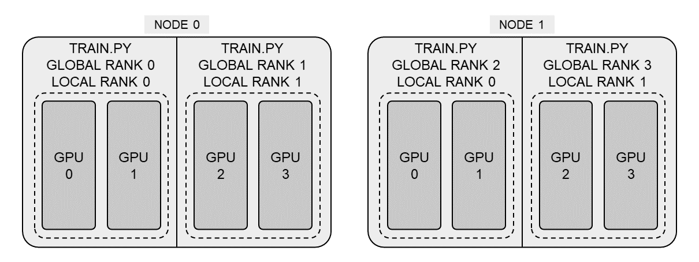

# speed_test
To test DDP, CPU, GPU vision-transformer forward/backward speed.

Concepts: Distributed training can be categorized into node and worker, two level.
As the below figure shows, each node contains two processes, and each process contains two cards. 


### How to run:
On machine 1:
```bash
torchrun --nnodes=2 --nproc_per_node=1 --node_rank=0 --master_addr=140.112.XX.XX --master_port=29500 speed.py --threads=64
```
On machine 2:
```bash
torchrun --nnodes=2 --nproc_per_node=1 --node_rank=1 --master_addr=140.112.XX.XX --master_port=29500 speed.py --threads=64
```

Explain:
The `--nnodes` argument specifies the number of nodes (machines) participating in the distributed training. In this case, `--nnodes=2` indicates that there are two nodes involved in the training process. This argument ensures that the distributed training job is aware of the total number of nodes that will be used.

The `--nproc_per_node` argument specifies the number of processes to run on each node. Here, `--nproc_per_node=1` means that one process will be run on each node. This is useful for controlling the level of parallelism within each node.

The `--node_rank` argument is used to assign a unique rank to each node. The rank is an integer that uniquely identifies each node in the distributed setup. For machine 1, `--node_rank=0` assigns it a rank of 0, and for machine 2, `--node_rank=1` assigns it a rank of 1. This helps in coordinating the nodes during the distributed training.

The `--master_addr` argument specifies the IP address of the master node, which is responsible for coordinating the training process. Both commands use the same *master address* (140.112.XX.XX), indicating that this IP address is accessible by both nodes.

The `--master_port` argument specifies the port on which the master node will listen for incoming connections from other nodes. In this case, `--master_port=29500` is used for communication between the nodes.

Finally, `speed.py --threads=64` is the script being executed with an additional argument `--threads=64`, which likely specifies the number of threads to be used by the script per process. This script is responsible for the actual training process and utilizes the specified number of threads for computation.

### Issue:
1 .If you have port gloo error, please use:
```bash
export GLOO_SOCKET_IFNAME=ens81np0
```


2. If torchrun does not use the correct env:
```bash
export PATH="../../speed_test/env/bin:$PATH"
```
Use `which torchrun` to chech.


### Code structure
Use local_rank to pass:
```
parser = argparse.ArgumentParser()
parser.add_argument('--local-rank', default=-1, type=int)
args = parser.parse_args()
```
Initialize:
```
import torch.distributed as dist
dist.init_process_group(backend='nccl')
torch.cuda.set_device(args.local_rank)
```
GPU uses 'nccl', 'cpu' uses 'gloo'.

Split dataset:
```
from torch.utils.data.distributed import DistributedSampler

sampler = DistributedSampler(train_dataset)
train_dataloader = DataLoader(train_dataset, sampler=sampler)
```

Prepare the model:
```
from torch.nn.parallel import DistributedDataParallel

model = DistributedDataParallel(model, device_ids=[args.local_rank])
```
